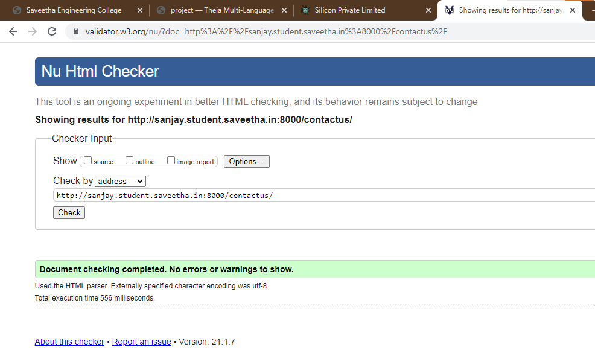

# Web Design for a Manufacturing Company
## AIM: 
To design a static website for a chip manufacturing company.

## DESIGN STEPS:
### Step 1: 
Requirement collection.
### Step 2:
Creating the layout using HTML and CSS.
### Step 3:
Updating the sample content.
### Step 4:
Choose the appropriate style and color scheme.
### Step 5:
Validate the layout in various browsers.
### Step 6:
Validate the HTML code.
### Step 6:
Publish the website in the given URL.

## PROGRAM:

### base.html
```

<!DOCTYPE html>
<html lang="en">

<head>
    <title>Silicon Private Limited</title>
    <link rel="stylesheet" href="">
    <link rel="icon" href="" type="image/x-icon">

</head>

<body>
    <div class="menu">
        <div class="menuitem"><a href="/home">Home</a></div>
        <div class="menuitem"><a href="/products">Products</a></div>
        <div class="menuitem"><a>Silicon<br>Corp</a></div>
        <div class="menuitem"><a href="/people">People</a></div>
        <div class="menuitem"><a href="/contactus">Contact Us</a></div>
    </div>
    <div class="content">
        <div class="container">
            <div class="banner">
                <h1 id="title">Silicon<br>Corp<br>Limited</h1>
            </div>

            
            
        </div>
        <div class="footer">
            Copyright © 2020 Silicon Corp Limited, Developed by Sanjay Boven
        </div>
    </div>
</body>

</html>
```

### home.html
```



<h2>Our Story</h2>
        
        <p>Silicon Pvt Ltd, provides a wide range of semiconductor and infrastructure software applications that serve
            the data center, networking, software, broadband, wireless, and storage and industrial markets. Common
            applications for its products include data center networking, home connectivity, broadband access,
            telecommunucations equipment, smartphones, base stations, data center servers and storage, factory
            automation, power generation and alternative energy systems, displays,and mainframe operations and
            management, and application software development. 
        </p>
     
     <p1> Some of Silicon's core technologies and products include: </p1>
    <ul class="margin">
        <li>|     Memory Chips     |</li>
        <li>|     SATA HDD     |</li>
        <li>|    SATA SSD     |</li>
        <li>|     Broadband Modems     |</li>
        <li>|     Wifi Devices      |</li>
        <li>|     Switching Devices      |</li>
        <li>|     Optical Sensors     |</li>
    </ul> 
    </div>
    </div>

```
### products.html
```



    <div class="productcontent">    
    <h1>Our Premium Products</h1>
    <div class="productitems">
        <div class="productitem"> 
            <div class="itemimage">
            
            </div>
            <div class="itemname">HyperX Impact 16GB 2666MHz DDR4 CL15 260-Pin SODIMM Laptop Memory (HX426S15IB2/16)</div>
            <div class="itemprice">Price: Rs.5000.00 </div>
        </div>
        <div class="productitem"> 
            <div class="itemimage">
            
            </div>
            <div class="itemname">Gigabyte GeForce GT 710 2GB Graphic Cards and Support PCI Express 2.0 X8 Bus Interface. Graphic Cards Gv-N710D5-2Gil</div>
            <div class="itemprice">Price: Rs.3400.00 </div>
        </div>
        <div class="productitem">
            <div class="itemimage">
               
            </div>
            <div class="itemname">TP-Link AC750 Wifi Range Extender | Up to 750Mbps | Dual Band WiFi Extender, Repeater, Wifi Signal Booster, Access Point| Easy Set-Up | Extends Wifi to Smart Home & Alexa Devices (RE200)</div>
            <div class="itemprice">Price: Rs.2030.00</div>
        </div>
        <div class="productitem">
            <div class="itemimage">
                
            </div>
            <div class="itemname">TP-Link RE205 AC750 Universal Wireless Dual Band Range Extender, Broadband/Wi-Fi Extender, WiFi Booster/Hotspot with Ethernet Port, 2 External Antennas, Plug and Play, Smart Signal Indicator, 750Mbps</div>
            <div class="itemprice">Price: Rs.2700.00</div>
        </div>
        <div class="productitem">
            <div class="itemimage">
                
            </div>
            <div class="itemname">TP-Link RE205 AC750 Universal Wireless Dual Band Range Extender, Broadband/Wi-Fi Extender, WiFi Booster/Hotspot with Ethernet Port, 2 External Antennas, Plug and Play, Smart Signal Indicator, 750Mbps</div>
            <div class="itemprice">Price: Rs.2700.00</div>
        </div>
        <div class="productitem">
            <div class="itemimage">
                
            </div>
            <div class="itemname">AMD Ryzen 3 3200G with RadeonVega 8 Graphics Desktop Processor 4 Cores up to 4GHz 6MB Cache AM4 Socket (YD3200C5FHBOX)</div>
            <div class="itemprice">Price: Rs.10,600.00</div>
        </div>
        <div class="productitem">
            <div class="itemimage">
                
            </div>
            <div class="itemname">Gigabyte GA-H61M-S Intel 3rd Motherboard / Intel H61 Chipset / Socket 115 / PCI-EX 16 Generation 3 / Micro ATX / Dual Channel DDR3 x 2 / HD Audio / Gbe LAN / 3Gb/s SATA x 4 / USB 2.0</div>
            <div class="itemprice">Price: Rs.6,220.00</div>
        </div>
        <div class="productitem">
            <div class="itemimage">
                
            </div>
            <div class="itemname">Samsung 860 EVO 250GB SATA 2.5" Internal Solid State Drive (SSD) (MZ-76E250)</div>
            <div class="itemprice">Price: Rs.4,220.00</div>
        </div>
        <div class="productitem">
            <div class="itemimage">
                
            </div>
            <div class="itemname">GIGABYTE SSD 1TB</div>
            <div class="itemprice">Price: Rs.9,120.00</div>
        </div>
    </div>
    </div>

```
### people.html
```



<div>
    
    <h2 class="pos">Chief Executive Officer</h2>
    <h3>Henry Cavill</h3>


</div>
<div>
    
    <h2 class="pos">Chief Financial Officer</h2>
    <h3>Robert pattinson</h3>
</div>
<div>
    
    <h2 class="pos">Chief Operating Officer</h2>
    <h3>Margot Robbie</h3>


</div>
<div>
    
    <h2 class="pos">Chief Marketing Officer</h2>
    <h3>Jason Momoa</h3>

</div>
<div>
    
    <h2 class="pos">Chief Technology Officer</h2>
    <h3>Amber Heard</h3>

</div>
<div>
    
    <h2 class="pos">Founder</h2>
    <h3>Sanjay Boven</h3>

</div>



```
### contactus.html
```



<div>
    
    
    <h3>Siliconcorp12@gmail.com</h3>
    <h3>686-483-756</h3>
    <br>
    <br>
    
</div>

```
## OUTPUT:


## CODE VALIDATION REPORT:



## RESULT:
Thus a website is designed for the chip manufacturing company and is hosted in the URL http://sanjay.student.saveetha.in:8000/. HTML code is validated.